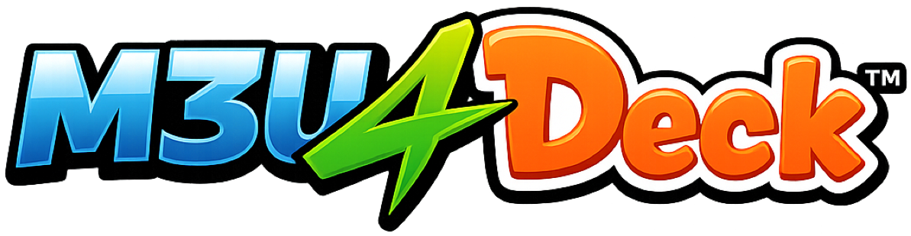
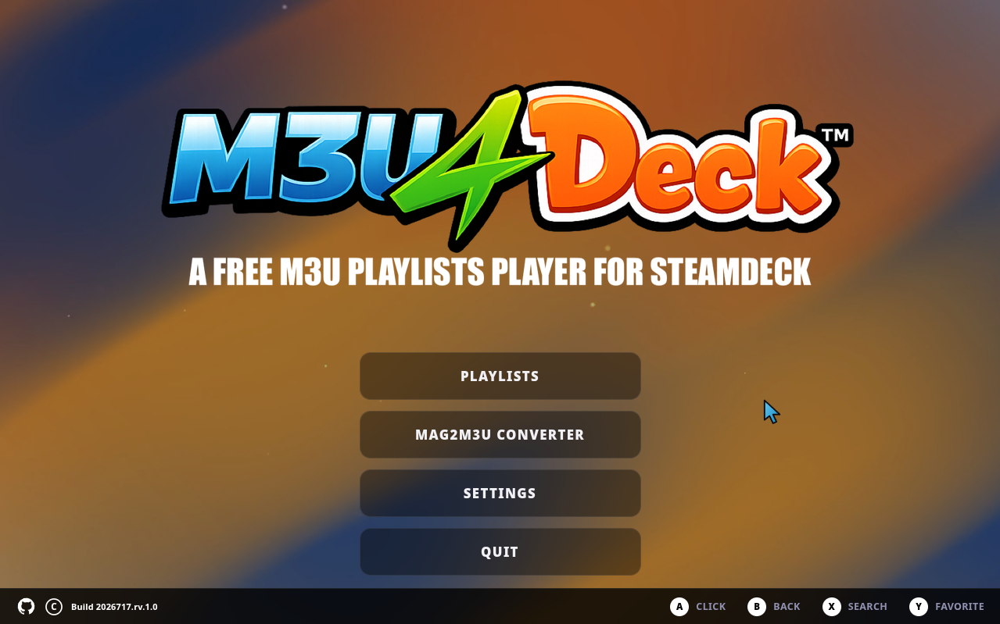

  

A Free M3U|M3U8 Playlists Player Built for Steam Deck

> [!CAUTION]
> M3U4Deck is a media player only. We do not provide playlists, channels, or any streaming content.
> 

  

## Features
- Load M3U playlists from a URL or local file
- Combined "All Streams" / "All Favorites" views across every playlist
- Built-in MAG2M3U Converter — generate a playlist directly from a MAG/Stalker portal URL + MAC address
- Parental Control Mode — PIN-gated adult content
- Custom background (image/video/loop)
- Full Gamepad support
- 30 FPS Mode (Low Battery? No problem!)

## Getting Started
1. Download the latest release (or clone this repo)
2. Double-click `Add M3U4Deck to Steam.desktop` to add it to your Steam library with controller support pre-configured
3. Launch from Steam, in Desktop Mode or Gaming Mode

## MAG2M3U (standalone converter)
Included separately for generating a playlist file from the terminal, without opening the app:
- **MAG2M3U** — converts a MAG/Stalker portal to an `.m3u` file
- **MAG2M3U_adult** — same, but also pulls Adult content channels; password-protected (Verify your age with our Discord mods to get access.)

## Support
- 🐛 Issues / bugs → open a GitHub issue
- 💬 Community & support → [Discord](https://discord.gg/Ru7TFNm4rz)
- ❤️ Support the project → see the Credits page in-app

## Credits
Tested by **Crowland** and **JD Ross**. Built with love for the community, as a token of appreciation. ❤️

Endorsed by [RELEASE THE QUACKEN 2.0](https://discord.gg/Ru7TFNm4rz)

## License
All rights reserved. See [LICENSE](LICENSE).

---
Made by [Ke619](https://github.com/Ke619)
